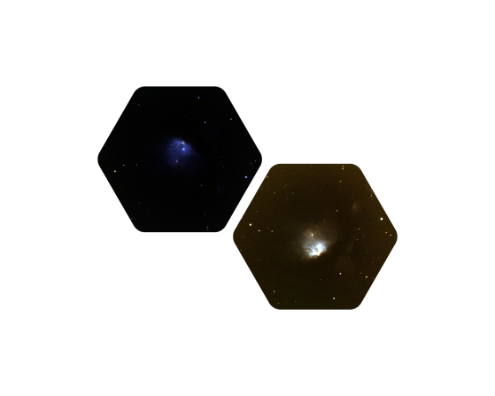

<table>
  <tr>
    <td width="50%" align="center"></td>
    <td width="50%">
      <h1>:rainbow: Spencer Riley</h1>
        <i>
          Long time open-source developer. First-year graduate student at Montana State University. Prospective solar physicist.
        </i>
      <br><br>
        <a href="https://sriley.dev">
    
 </a>
  <a href="https://cv.sriley.dev">
    
  </a>
  <a href="mailto:academic@sriley.dev">
    
  </a>
      <br>
      <a href="https://board.sriley.dev">
    
 </a>
 <a href="https://rgate.sriley.dev">       
   
  </a>
  <a href="https://orcid.org/0000-0001-7949-9163">
    
  </a>
      <br>
          <a href="https://github.com/PharaohCola13?tab=repositories&sort=stargazers">
      
    </a>
    <a href="https://github.com/PharaohCola13?tab=followers">
      
    </a>
  </td>
  </tr>
</table>
<hr>
<h3>A Bit About Me</h3>

```R
  about.me <- function(...){
    ifelse(pronouns, "He", "Him")
  
    Languages <- c("C", "Fluter", "HTML", "IDL", "JavaScript", "LaTeX", "Python", "R", "Shell")
    FrameWorks <- c("Docker", "Jupyter", "Kubernetes")
    CI <- c("GitHub Actions")

    currently.learning <- "Numerical simulation methods to study magnetohydrodynamics."

    goals.todo <- list(year.2023=list("[ ] Finish writing stuff for my blog",
                                      "[ ] Find some good recipes", 
                                      "[0/4] Pass my Doctoral Qualifying Exams",
                                      "[ ] Finish PMAT V3.0 (Guess I didn't finish this yet)",
    # Draft available: https://github.com/physicsgoddess1972/Precipitable-Water-Model/blob/paper/paper.pdf
                                      "[ ] Finish a paper for the Journal of Open Source Software"))
    goals.completed <- list(year.2023=list(),
                            year.2022=list("[x] Get into graduate school",
    # Paper is available at https://doi.org/10.5194/amt-15-1563-2022
                                           "[x] Published first paper"))
                                            
    fun.fact <- "My favorate animal is the whale shark"
  }
  
  about.me()
  
```
<hr>

<table>
  <tr>
    <th><h3>Images of Messier 78 :telescope:</h3></th>
    <th><h3>Trophies</h3></th>
  </tr>
  <tr>
    <td width="50%" align="center"></td>
    <td width="50%" align="center"></td>
  </tr>
</table>
